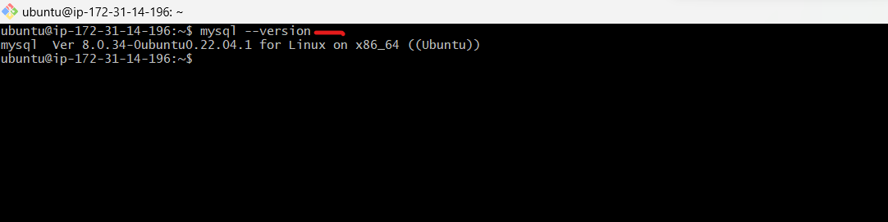
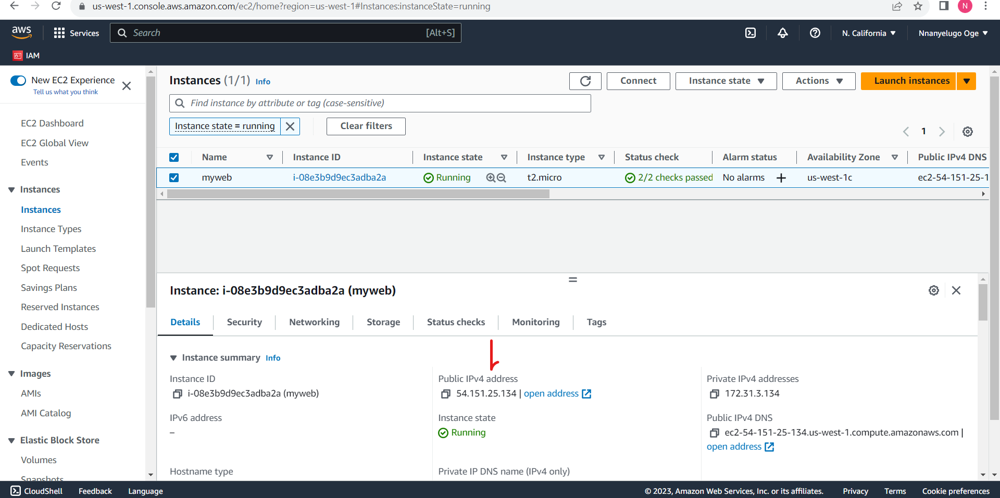

# Lamp-stack-project

## Lamp stack

__Lamp stack__ is a bundle of 4 different software technologies that developers use to build websites and web applications.

__L__ stands for __linux__ (the operating system-ubuntu)

__A__ stands for __Apache__ (the web server-HTTP server)

__M__ stands for __mysql__ (the database server)

__P__ stands for __php__ (the programming language)

__let's get started with the installation__

_let's launch an instance on our AWS account, give it any name of your choice_

_choose ubuntu OS_

_create a keypair_

_create a security group, to allow HTTPS traffic and lauch instance_

_let's ssh into our ubuntu terminal_

`ssh -i Downloads/jenkinskey.pem ubuntu@54.219.139.207`

_downloads: is where your keypair is kept_

_jenkinskey.pem: is the name of your keypair_

_ubuntu: is the name of your server_

_54.219.139.207: is the ip address_

__let's install apache2__

_first we update ,so that all the latest applications can be installed smoothly._

`sudo apt update`

`sudo apt install apache2`

_you need to adjust your firewall settings to allow HTTP traffic. Ubuntu default firewall configuration tool is called (__uncomplicated firewall-ufw__)_

_to list and open all available firewall_

`sudo ufw app list`

_to allow traffic on port 80_

`sudo ufw allow in "Apache full"`

_to check if the service is running_

`sudo systemctl status apache2`

_to view the outcome of your work, you paste your ip address on your website_

_to check where your configuration site for your website are:_

`cd /etc/apache2/`

_then cd into the available sites_

`cd /sites-available/`

`vim 000-default.conf`

__MYSQL-SERVER__

_mysql is mostly used as database and to store data_

_lets install __mysql-server___

`sudo apt install mysql-server`

 _check the version_

 `mysql --version`

 

 _to check if the service is running_

 `sudo systemctl status mysql.service`

 

 _let's do some configurations_

 `sudo mysql_secure_installation`

 

`sudo mysql`

 _to set password as "Password1@" for root user_

 `ALTER USER 'root'@'localhost'  IDENTIFIED WITH mysql_native_password BY  'Password1@' `

 

 _then "exit"_

_log into mysql using the password_

`sudo mysql -p`

_then"exit"_

__INSTALLING PHP__

_let's install php_

`sudo apt install php libapache2 -mod-php php-mysql`

_after installing, you can check the version_

`php -v`

_in order to verify that PHP is running on the server, we create a file in web root directory located at `/var/www/html/`_

_Create a file in the web root directory:_

`sudo nano /var/www/html/info.php`

_inside the file, type the PHP code:_

`<?php`

`phpinfo ();`

`?>`

_Press `CTRL + X` to save and close the file. Press `y` and `ENTER` to confirm._

_then open your internet browser and type the ip address_

_copy the ip address_

`[server-ip-address]/info.php`

_Here is the detailed output of __LAMP STACK WEBSITE___

